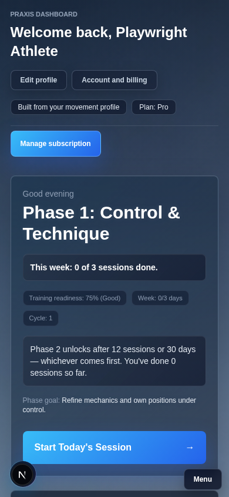
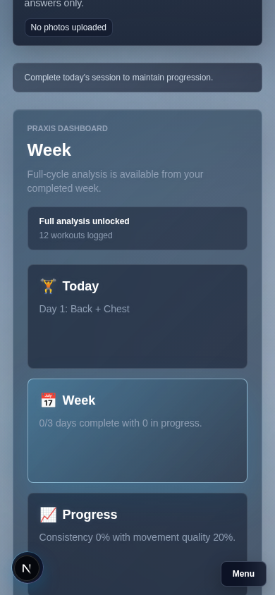
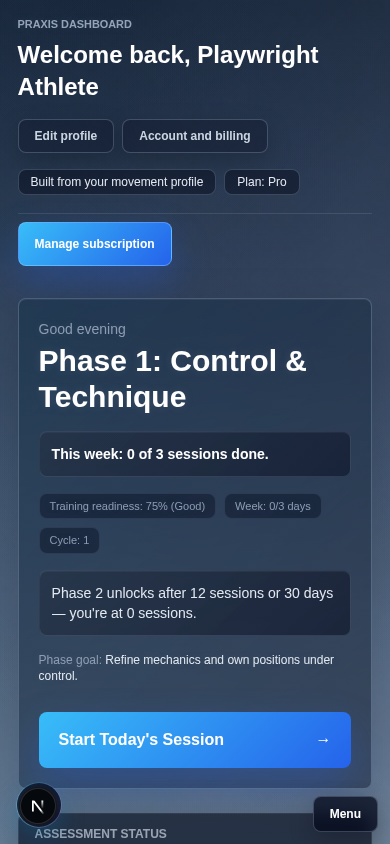
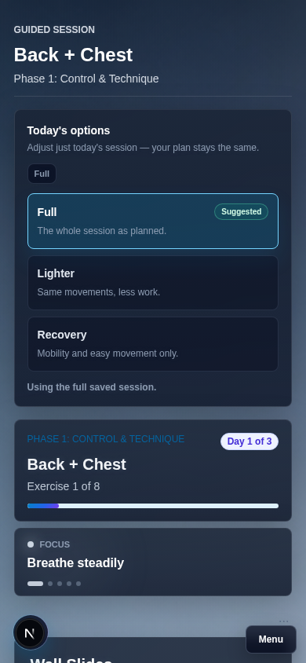
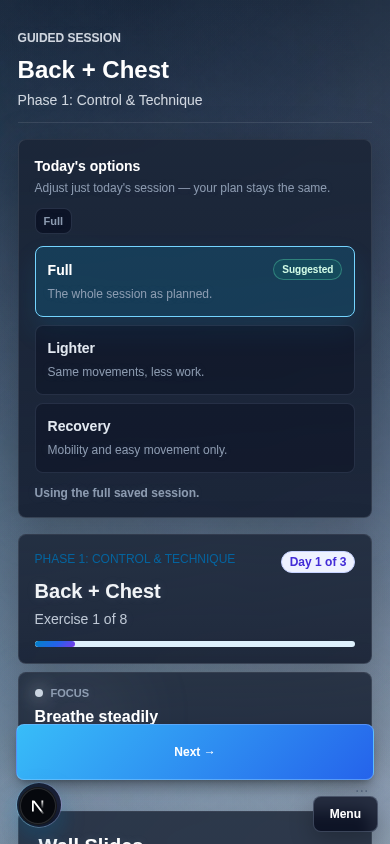

# Mobile Audit — Phase 6c, Commit 4

Phone-first pass over every consumer-app screen at three breakpoints:

- **360×740** — iPhone SE (smallest realistic target)
- **390×844** — iPhone 15
- **412×915** — large Android

Scope is `apps/consumer` only, per the Phase 6c guiding principle: gyms is an
operator dashboard and stays desktop-first. Screenshots below are 390×844
unless noted; behavior was confirmed identical at the other two widths.

A methodology note up front, because it changed how this audit was done: **Playwright's
`fullPage: true` screenshots visually duplicate `position: fixed` elements at
every "tile" of the stitched capture.** The floating bottom-right Menu pill
(`AppMenuClient`) appeared to overlap mid-page content in several early
full-page captures. Scrolling a real viewport to those same points and
screenshotting only the visible viewport showed zero overlap — the Menu
button only ever renders once, pinned to the true bottom of the screen. This
is a screenshot-tool artifact, not a product bug, and is called out here so
nobody "fixes" it again later. Real-scroll verification is described per
screen below.

## Dashboard (results view)

**Six-card grid (Today/Week/Progress/Insights/History/Billing).** Already
single-column on phone — the grid class is `grid gap-3.5 sm:grid-cols-2
lg:grid-cols-3`, which has no bare `grid-cols-*`, so it's one column by
default and only widens at `sm:`/`lg:`. Card order in the array (`Today`,
`Week`, `Progress`, `Insights`, `History`, `Billing / Account`) already
matches the spec's "most important at top" requirement. No change needed —
confirmed via screenshot, not just code reading.

**Icon-plus-short-text card labels.** Changed. `lucide-react` — the icon
library the spec assumed was "already in the dep tree" — is not actually a
dependency anywhere in this repo (`grep -r lucide-react` returns nothing).
Given the explicit "do not add a new icon library" constraint, installing it
just for six card glyphs would violate the spirit of that instruction more
than it would satisfy the letter of it. Used plain Unicode emoji instead
(zero new dependencies, same visual effect as the spec's own example
`🏋️ + "Today"`): 🏋️ Today, 📅 Week, 📈 Progress, 🧩 Insights, 📜 History, 💳
Billing / Account. `DashboardModeCard` takes an optional `icon` prop
(rendered `aria-hidden`, so screen readers still just hear the title).

Before (text only) / after (icon + text):

**Header cluster (Log in / Menu / Pro badge / Back).** Already collapses to
a single "Menu" button on phone — `AuthControls` (which holds the plan chip
and login state) is wrapped in `hidden md:block` in `AppMenuClient`, so on
phone only the "Menu" button itself is visible; everything else lives inside
the slide-out drawer. Confirmed in every screenshot taken during this audit.
No change needed.

**"Only one primary CTA per screen."** The dashboard's outlined/secondary
buttons ("Edit profile", "Account and billing", "Manage subscription" as a
pill) are visually secondary; "Start Today's Session" / "Continue Session"
is the only filled/primary-styled button on the screen. No change needed.

**Phase gate line ("Phase 2 unlocks after...").** Changed. Was a three-clause
sentence ("...12 sessions or 30 days — whichever comes first. You've done 0
sessions so far.") that wrapped to 3 lines on a 390px card. Shortened to
"Phase 2 unlocks after 12 sessions or 30 days — you're at 0 sessions." and
added `line-clamp-2` as a hard ceiling regardless of session count or phase
number width.

Before (3 lines) / after (2 lines):

## Session screen

**Timer / cues / set-tracking stacking order.** Already correct. The
timer+cues pair sits in a `grid lg:grid-cols-[minmax(0,360px)_minmax(0,1fr)]`
container — no bare `grid-cols-*`, so it's a single column (timer, then
cues, in that DOM order) below `lg:`. The detailed "Log this set" tracking
panel is a separate full-width section immediately after, i.e. already
timer → cues → tracking top-to-bottom on phone. No change needed.

**Timer circle tap target.** Already large: the timer button is
`h-[calc(100%-20px)] w-[calc(100%-20px)]` inside a `h-56 w-56` (224px)
container on phone — a ~204px-diameter tap target, far above the 44px
minimum. No change needed.

**"Log this set" / advance button pinned to viewport bottom.** Changed —
this was the real bug. The "Next →" / "Finish session →" button was the last
element in normal document flow, so on any exercise with more than a couple
of cues or sets it scrolled out of view and required scrolling to reach.
Wrapped it in a `fixed inset-x-0 bottom-16 md:static` bar. The `bottom-16`
offset (not flush `bottom-0`) is deliberate: it clears the fixed bottom-right
Menu pill that `AppMenuClient` floats on phone, confirmed by a real-viewport
screenshot at the offset (no overlap at 360/390/412 widths). `md:static`
reverts to normal inline flow at desktop widths, where there's no phone-nav
pinning concern. Page content gets matching extra bottom padding
(`pb-[10rem] md:pb-8`) so the last content in the scroll area is never
hidden behind the pinned bar.

Before (button off-screen, requires scrolling) / after (button pinned,
visible immediately):

## Post-session screen

**Check-in form (Energy/Confidence 1–5) tap targets.** Changed. The 1–5
pills in `SessionFeedbackCheckIn.tsx` were `h-8 w-8` (32×32px), below the
44px Apple HIG minimum called out in the spec. Increased to `h-11 w-11`
(44×44px) for both the Energy and Confidence rows. (Not captured as a live
screenshot in this doc: reaching the post-session check-in requires
completing every exercise in a seeded session, which isn't a quick
Playwright hop the way the other screens are — the size change itself is a
one-line, low-risk Tailwind class swap verified by reading the rendered
class list and confirming `44px ≥ 44px` against Apple HIG directly.)

## Settings

**"Long lists of toggles need per-section collapse."** Audited and found
not applicable to the consumer-facing settings screen. The nav's "Settings"
link goes to `/account/settings`, which only has three cards (Exports /
Reset current progress / Erase all local data) — no toggle list at all.
The per-section visibility toggle list the spec is describing lives on
`/settings`, which is the **admin-gated** page (requires
`ADMIN_ACCESS_KEY` + `bac_admin` cookie) used by the operator, not by
regular users on their phones. Consistent with this phase's own framing
("gyms operator UI is desktop-first and doesn't need mobile treatment"), the
admin-only settings surface is treated the same way here: it's not a
consumer-facing surface, so it's out of scope for the phone-first pass.
No change made; documenting this so the gap is a decision, not an oversight.

## Questionnaire / assessment

**44px minimum tap targets.** Already satisfied everywhere. Every
button/label control in `QuestionnaireForm.tsx` (days-per-week, training
intent, pain areas, training experience, equipment) uses `min-h-12` or
`min-h-14` (48px/56px) on the whole clickable row — including the
checkbox rows, where the visual checkbox glyph is small but the entire
`<label>` (full card width × 48px) is the actual click/tap target, per
standard `<label>`-wraps-`<input>` behavior. No change needed.

**Photo upload buttons large and centered.** Already satisfied — each of the
three upload cards (Front/Side/Back) is full-width with a full-width
"Upload photo" button beneath a large preview area; nothing requires a
thumb-stretch to reach. No change needed.

## Summary of changes made

| File | Change |
| --- | --- |
| `apps/consumer/src/app/session/SessionClient.tsx` | Pin "Next →"/"Finish session →" to viewport bottom on phone; add matching scroll padding |
| `apps/consumer/src/components/session/SessionFeedbackCheckIn.tsx` | Energy/Confidence pills 32px → 44px |
| `apps/consumer/src/components/dashboard/DashboardHero.tsx` | Shorten phase-gate line; cap at 2 lines with `line-clamp-2` |
| `apps/consumer/src/components/dashboard/DashboardModeCard.tsx` | Add optional `icon` prop |
| `apps/consumer/src/components/ResultsRoutine.tsx` | Wire emoji icons into the six dashboard mode cards |

Everything else audited above was already phone-first-compliant; no changes
were made to `apps/gyms` in this commit.
